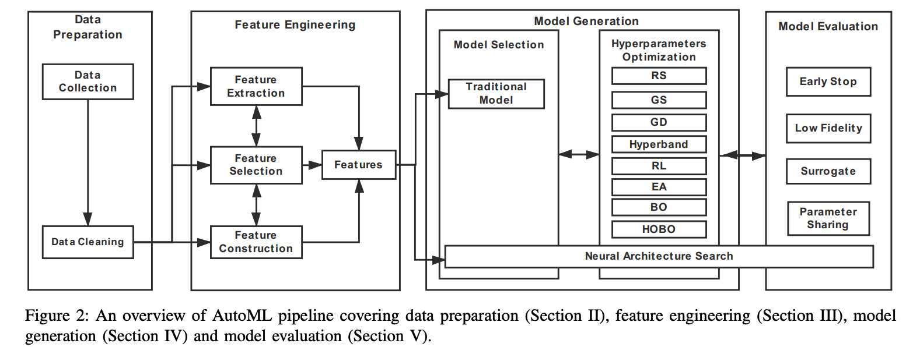
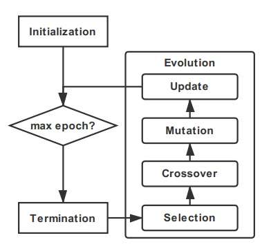
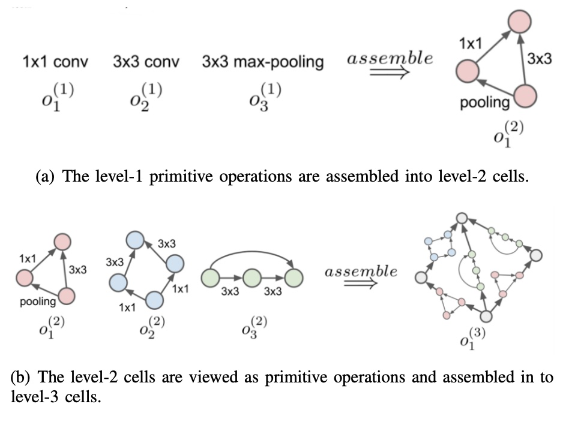
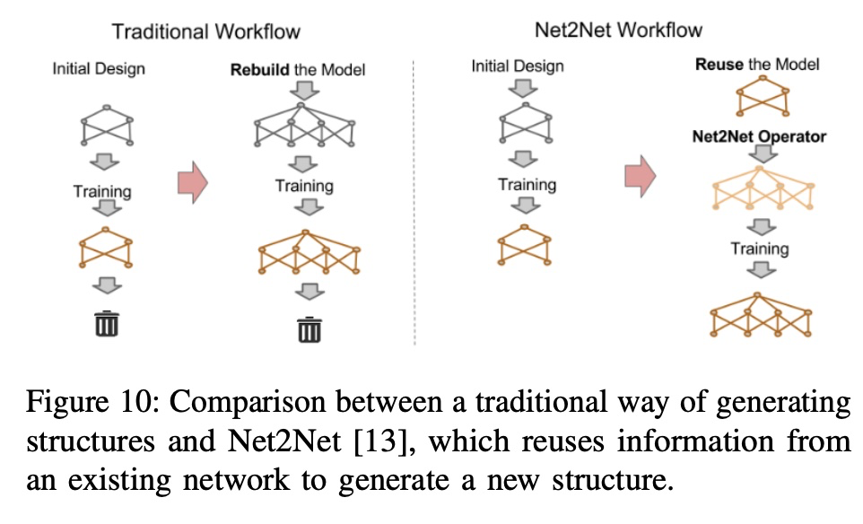
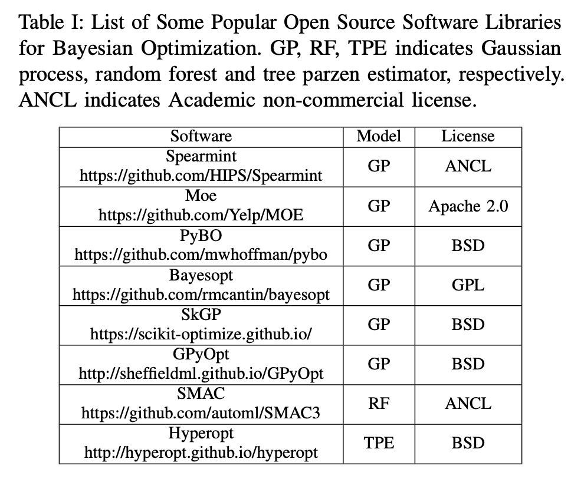
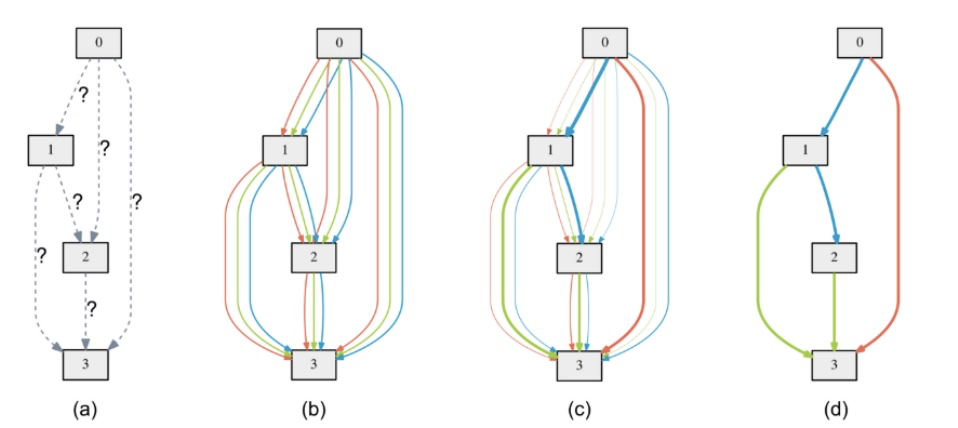
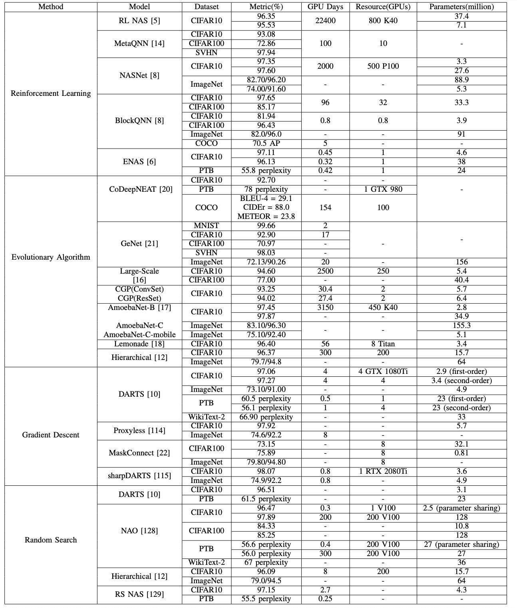
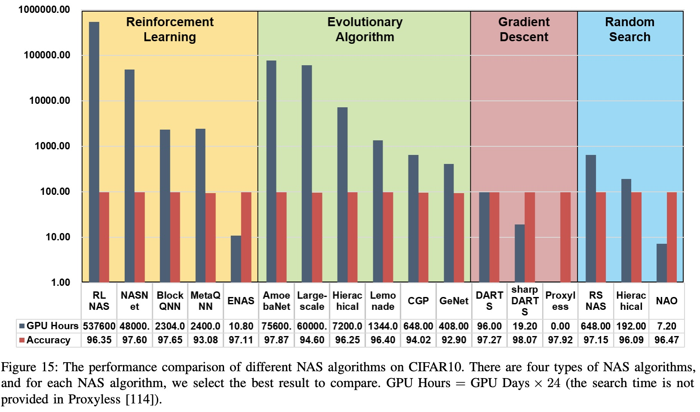
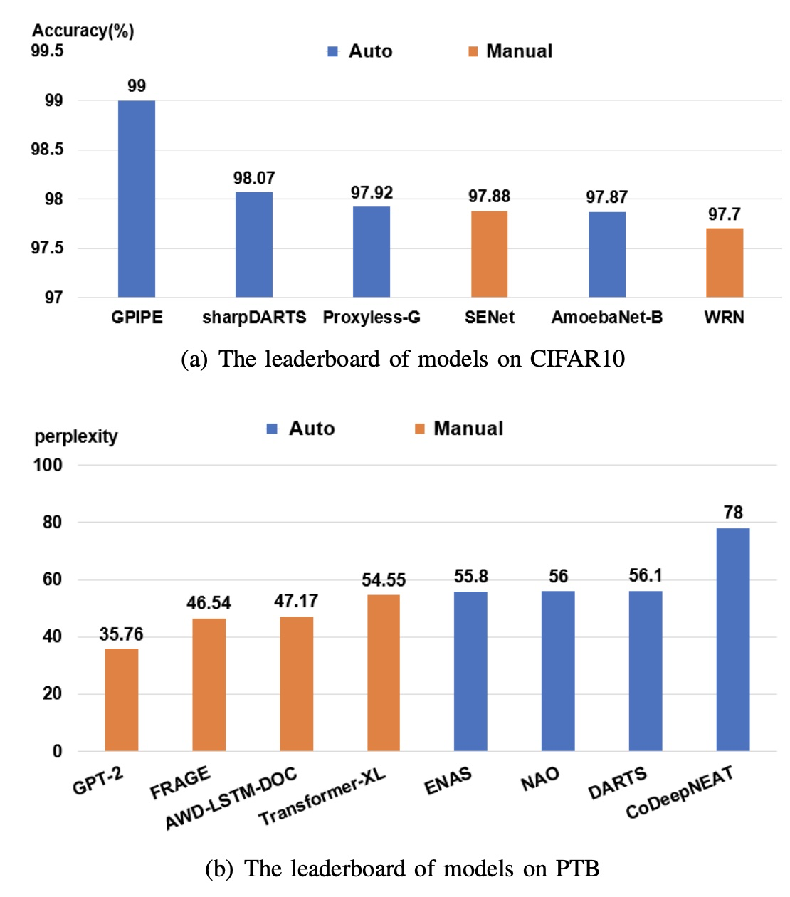

### AUTOML

* [AUTOML](#automl)
   * [1. Data Preparation](#1-data-preparation)
      * [1. 数据收集](#1-数据收集)
      * [2. 数据清理](#2-数据清理)
   * [2. Feature Engineering](#2-feature-engineering)
      * [1. 特征选择](#1-特征选择)
      * [2. 特征构造](#2-特征构造)
      * [3. 特征抽取](#3-特征抽取)
   * [3. 模型生成](#3-模型生成)
      * [1. 框架](#1-框架)
      * [2. 超参调优 Hyperparameter Optimization(HPO)](#2-超参调优-hyperparameter-optimizationhpo)
   * [4. 模型评估](#4-模型评估)
   * [5. NAS 性能评估](#5-nas-性能评估)
   * [6. 展望和问题](#6-展望和问题)
      * [1. 完整的 AUTOML pipeline](#1-完整的-automl-pipeline)
      * [2. 可解释性](#2-可解释性)
      * [3. 可复现性](#3-可复现性)
      * [4. 灵活的编码方案](#4-灵活的编码方案)
      * [5. 更大的范围，不仅仅是图像分类](#5-更大的范围不仅仅是图像分类)
      * [6. 长任务的学习](#6-长任务的学习)
   * [引用](#引用)

Created by [gh-md-toc](https://github.com/ekalinin/github-markdown-toc)

如果想 AutoML 得到 SOTA 的效果:

#### 1. Data Preparation

这一部分，实际是在我们的设想之外，但是这一步数据处理缺对于模型的效果影响最大。

##### 1. 数据收集

目前做法，数据采集部门采集。

1. 数据增强

   1. 普遍做法：翻转，剪切，填充等 torchvision、Augmentor 库可以实现
   2. 新方法：data warping and synthetic over-sampling：（迁移数据空间：同义词插入、文本翻译后再翻译回来、OpenAI gym 模拟数据、GAN生成图片等）

2. 数据搜索

   网络搜索遇到问题解决：

   1. 关键词不匹配：
   2. 对无标签数据：自学习打标签
   3. 网络数据的分布和目标不一致 fine-tuning
   4. 数据不平衡问题

在 CV 方向是否可以分享一下在图像数据处理中的一些技巧，甚至可以抽象出来一些有用的东西。

##### 2. 数据清理

普遍的一些方法，例如： standardization, scaling,binarization of quantitative characteristic, one-hot encoding qualitative characteristic, and filling missing values with mean value。

相同的数据集对于不同的模型可能有不同的需求

#### 2. Feature Engineering

##### 1. 特征选择

过程：根据搜索策略得到特征子集 -> 验证集验证是否有效 loop

搜索策略：

1. complete
   1. Breadth First Search(广义优先搜索), Branch and Bound（分支和边界）, Beam Search（定向搜索）, and Best First Search.
2. heuristic 启发式
   1. Sequential Forward Selection (SFS) 从空数据集开始, Sequential Backward Selection (SBS) 从全数据集开始, and Bidirectional Search (BS).
3. random search
   1. Simulated Annealing (SA) and Genetic Algorithms (GA)

评估方法：

1. 根据散度或者关联度，设置阈值
2. 为特征打分：均值，方差，置信度，交互信息（例如熵）
3. embedded method: Regularization,decision tree, and deep learning

##### 2. 特征构造

1. 手动

   正则，笛卡尔积、M of N等

2. 自动

   decision tree-based methods , genetic algorithm

##### 3. 特征抽取

1. Principal Component Analysis(PCA), independent component analysis, isomap, nonlinear dimensionality reduction, Linear discriminant analysis (LDA)

2. 神经网络单元

#### 3. 模型生成

##### 1. 框架

1. ML: support vector machines (SVM), knearest neighbors (KNN), decision tree, KMeans 等
2. DL: NAS 

NAS:

1. 搜索空间， kernel size, Conv OP type(depthwise separable, dilation, deformable convolution);

2. 框架结构

   1. 全局， 缺点：搜索空间很大，在小数据集上找最优解很慢，而且在小数据集上迁移到大数据集上不好
   2. 单元， 先Cell ， stack cell to entire. 相对于全局搜索空间少，可移植性高

   Cell-based structures: 

   1. 两阶段：inner 选择 node 的 op 和连接；outer 调整空间分辨率 （但是目前普遍做法是链式结构）， “Auto-deeplab: Hierarchical neural architecture search for semantic image segmentation” 定义了一种网络级别的设计公式，对于多种经典模型做了复现 

   Hierarchical Structure:

   

   Network Morphism based structure基于网络形态: 

   

   Reuse replace rebuild， Net2net: Accelerating learning via knowledge transfer 利用 VGG16

##### 2. 超参调优 Hyperparameter Optimization(HPO)

算法种类：

1. grid & random search(网格或者随机搜索)

   问题：random 相对于 grid 来说提供更多的可能性，已经证明了不是所有的参数都是那么重要需要优化的。有人提出先进行搜索出较好的 region ，再进行 grid search；还有比较 grid search 最大似然,然后在这个点周围进行 grid search ，到局部最优值。

   random search 一定是比 grid search 好，耗时越长越好，为了解决耗时问题，提出 hyperband （hyperband 通过在训练中丢弃超参数只将有限的资源（time 或者 cpus）分配到有希望的超参数）

2. Reinforement Learning(强化学习)

   NAS 中利用 RNN 选择模型结构，进行模型的评价（准确率）作为 reward 是一种典型的强化学习框架。取得 STOA 的效果，但是代价是资源的巨大损耗；

   ENAS 解决资源的问题：通过将所有的 child model 作为整体图（已经训练好的）的子图，然后共享参数；

3. Evolutionary Algorithm（进化算法）

   [遗传算法算子](https://zhuanlan.zhihu.com/p/29474851)

   Encode scheme 表示网络模型:

   1. direct

      Genetic CNN 直接使用 0、1表示 node 的连接，易表示，但是计算空间是 node 的平方，而且 node 的数目是固定的；为了解决定长问题，Cartesian genetic programming  提出有向无环图

   2. indirect

      指定生成规则构建网络，Cellular Encoding (CE)将一系列神经网络编码成一组标记树；或者使用方法进行编码

   典型的进化算法包含：

   1. Selection 选择，三种策略：

      1. 计算选择的可能性 
      2. 基于排序
      3. Tournament selection 在 EA-based NAS 用的最多；每一轮迭代先选择 k 个（随机），根据性能排序后选择最优，最优概率 p, 次优就为 p*(1-p)

   2. Crossover 交叉

      1. 两个节点交叉作为父母节点，衍生出子节点

   3. Mutation 突变

      有做法：增加或删除跳层，或者调整学习率或者kernel size 

   4. Update 更新

      更新模型，去除一些不必要的模型，减少资源使用

4. Bayesian Optimization（贝叶斯优化）

   [贝叶斯优化深入理解](https://www.cnblogs.com/marsggbo/p/9866764.html)

   之前的方法都是对一个参数组进行判别，有些不重要的参数被重复的进行测试,理论见👆，最重要的思想是不断更新先验（是 grid 这种所并不具备的),还有就是不管目标函数是 stochastic, non-convex, 甚至noncontinuous 都有一定的作用。

   Hyperband 算法可以在一些限定情况下获得比较好的超参数，但是不能保证。Bayesian Optimization-based Hyperband (BOHB) 结合 BO 和 HYperband ；还有一种更快的 BO 叫FABOLAS，10x~1000x加速。

   

5. Gradient Descent 梯度下降

   上面的基于选择或者BO方法进行超参的自动优化选择，基本上在时间和资源上都有很大的消耗。

   由于上面的超参数选择都是不连续的，darts 提出通过 softmax 方法将超参数的选择松弛到连续可微分的搜索空间

   $\overline{o}^{(i, j)}(x)=\sum_{o \in \mathcal{O}} \frac{\exp \left(\alpha_{o}^{(i, j)}\right)}{\sum_{o^{\prime} \in \mathcal{O}} \exp \left(\alpha_{o^{\prime}}^{(i, j)}\right)} o(x)$

   在 nas 中 o(x) 为 OP的选择例如 Conv3x3 ...

   $\alpha$ 是参数向量(操作两个节点的混合权重，是连续的需要学习的)

   但是，注意 darts 的GPU显存使用量是和候选节点数量有关，如下图，每一个边界是预训练出来的,为了解决这个问题 PROXYLESSNAS: DIRECT NEURAL ARCHITECTURE SEARCH ON TARGET TASK AND HARDWARE 提出基于路径剪枝的方法。

   

   [SharpDARTS](http://aixpaper.com/view/sharpdarts_faster_and_more_accurate_differentiable_architecture_search) 加速 darts 并且准确率有一定的提示，有详细代码。

#### 4. 模型评估

为了加速模型评估，有一下做法：

1. Low fidelity: 

   1. 使用小的（size 大小，例如 Imagenet 的 32x32 版本或者更小）数据集验证
   2. 或者训练使用使用少的 kernel 层数

2. Transfer learning

   1. 论文 Transfer learning with neural automl， 使用任务先验知识加速
   2. ENAS 通过参数共享
   3. network morphism based algorithms也可以继承先前的框架参数

3. Surrogate 代理

   1. PNAS 使用代理控制，评估比 ENAS 快5倍，整体快8倍，但是在优化空间很大的时候很难量化，评估很费资源

4. Early-stopping

   一开始用于避免过拟合，现在用于加速

#### 5. NAS 性能评估

Metric: 对于 cifar10 数据集是准确率，对于 ImageNet 数据集是 Top1/Top5 

我们可以看到资源的损耗 GD < RS < EA < RL

我们可以看见对于图像应用，auto 超过人工设计，而对于语言模型，auto 离人为设定的还有很大的差距

#### 6. 展望和问题

##### 1. 完整的 AUTOML pipeline

现如今有不少开源AutoML库，如TPOT，Auto-sklearn都只是涉及整个pipeline的某一个或多个过程，但是还没有真正实现整个过程全自动，因此如何将上述所有流程整合到一个系统内实现完全自动化是未来需要不断研究的方向。

##### 2. 可解释性

深度学习网络的一个缺点便是它的可解释性差，AutoML在搜索网络过程中同样存在这个问题。目前还缺乏一个严谨的科学证明来解释

- 为什么某些操作表现更好
- 就基于单元结构设计的网络而言，很难解释为什么通过叠加单元结构就能得到表现不错的网络结构。另外为何ENAS提出的权值共享能够work同样值得思考

##### 3. 可复现性

大多数的AutoML研究工作都只是报告了其研究成果，很少会开源其完整代码，有的只是提供了最终搜索得到的网络结构而没有提供搜索过程的代码。另外较多论文提出的方法难以复现，一方面是因为他们在实际搜索过程中使用了很多技巧，而这些都没有在论文中详细描述，另一方面是网络结构的搜索存在一定的概率性质。因此如何确保AutoML技术的可复现性也是未来的一个方向。

##### 4. 灵活的编码方案

通过总结NAS方法我们可以发现，所有方法的搜索空间都是在人类经验的基础上设计的，所以最终得到的网络结构始终无法跳出人类设计的框架。例如现如今的NAS无法凭空生成一种新的类似于卷积的基本操作，也无法生成像Transformer那样复杂的网络结构。因此如何定义一种泛化性更强，更灵活的网络结构编码方式也是未来一个值得研究的问题。

##### 5. 更大的范围，不仅仅是图像分类

对于语言模型效果不好，还有例如目标检测、语义分割等任务

##### 6. 长任务的学习

大多数的AutoML都需要针对特定数据集和任务设计网络结构，而对于新的数据则缺乏泛化性。而人类在学习了一部分猫狗的照片后，当出现未曾见过的猫狗依然能够识别出来。因此一个健壮的AutoML系统应当能够终身学习，即既能保持对旧数据的记忆能力，又能学习新的数据。

#### 引用

- https://arxiv.org/pdf/1908.00709.pdf
