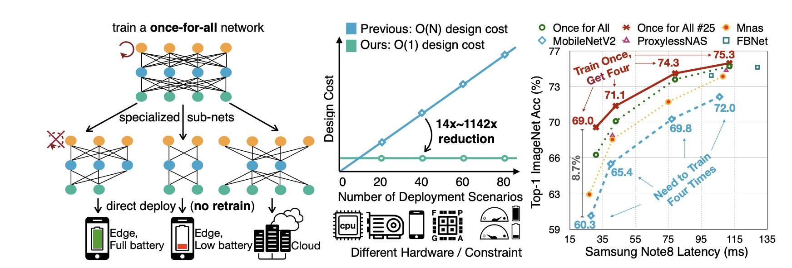
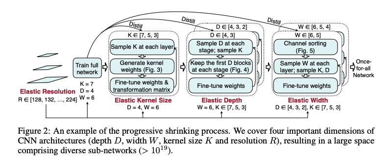
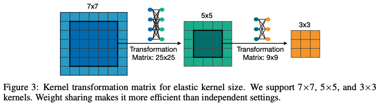
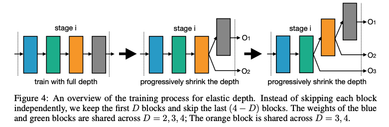
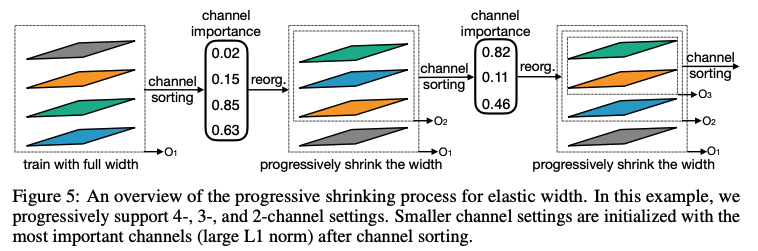

* [Once for All: Train One Network and Specialize it for Efficient Deployment](#once-for-all-train-one-network-and-specialize-it-for-efficient-deployment)
   * [1. 论文解析](#1-论文解析)
      * [1. 思路](#1-思路)
      * [2. 相关工作](#2-相关工作)
      * [3. 方法](#3-方法)
      * [4. 实验](#4-实验)
   * [2. 代码分析](#2-代码分析)
   * [3. 引用](#3-引用)

Created by [gh-md-toc](https://github.com/ekalinin/github-markdown-toc)

### Once for All: Train One Network and Specialize it for Efficient Deployment

[论文](https://arxiv.org/pdf/1908.09791.pdf)、[代码]()

#### 1. 论文解析

##### 1. 思路

1. 上图中间针对模型部署多种后端设备效果不同，需要单独做优化的痛点，从 O(N) -> O(1)
2. 上图左边指出 Once for All 一次训练后，序列化子图后推理（无训练）
3. 上图右边图指出 Once for All 获取不同的 latency 不需要训练，只需训练一次
4. 动态的支持不同的 depth、width、kernel size、resolutions 而不需要训练
5. 渐进搜索算法（为了解决选择空间过大），先取最大的 depth、width、kernel、resolution，渐进的减小支持小的子集（也有很好的迁移效果）

##### 2. 相关工作

1. 对于端上设备如何使神经网络更加的高效
   1. 使用小模型 SqueezeNet、MobileNet、ShuffleNet
   2. 量化剪枝现有模型，在不减少性能的基础上
2. NAS 
   1. Hard ware NAS 将设备回馈到 search 过程,例如 作为 reward 信号或者在 loss 上，但是如果出现新的设备，依旧需要重新训练
3. Dynamic Neural Network
   1. 使用 基于输入的跳过连接 来减少深度（ResNet），使用 控制器或者门控模块 来适应性的删除某些单元，使用 提前退出分支 在计算图中根据准确率判断是否可以提前结束，根据输入图像适应性的降低通道数来提高效率
   2. 这些方法继承了预先设计的网络结构，同时也受限制于他们的性能，即对于新的场景现有的结构可能不是最优的。可调节的灵活性受到限制
     

##### 3. 方法

1. 选择 4 个维度：depth、width、kernel size、resolution（分辨率）,例如 dilation 或者 groups 并未做搜索

2. Training the Once of All Network

   1. 初步：如何构建网络：

      1. Network-level: 设置不同的输入，使用弹性的分辨率
      2. Stage-level: 每个 stage 使用不同的 block 数量，弹性 depth
      3. Block-level: 使用不容的 channel （弹性 width）以及 kernel size

      搜索空间是 10^19，如何解决？渐进减少方法（progressive sharinking approach）

   2. 渐进减少方法

      1. 使用最大的 [depth, width, kernel size]和弹性的分辨率
      2. 然后进行 fine-tune 在大的子网络到小的子网络上

      三个好处：

      1. easy to optimize 因为子任务比全任务简单
      2. 小模型比大模型更容易训练，小模型更好的初始化并保持大模型的重要的参数，通过知识蒸馏更好的监督 
      3. 共享参数并且防止小的子网络伤害大的子网络的性能

   3. 四种维度方法：

      1. 分辨率

         

         理论上我们可以输入任意分辨率的图片，因为图片的 size 是不影响CNN的参数，然而在实际应用过程中，如果训练没有见过分辨率可能会大大影响准确率，通过修改 data loader 修改输入的分辨率

      2. kernel size

         

         如上图所示，我们可以通过中心减资额的方式从大的 kernel 中获取晓得额 kernel ，但是卷积核是图片矩阵分布的体现，简单的这样剪切会大大影响子模型的性能；在两两 kernel  之间使用核变换矩阵，在每一个 block 中，每一个 channel 共享 该核变换矩阵 

      3. depth

         

         每一个 block (MBConv)包含一个 depth-wise convolution 和 两个 point-wise convolution ;从含有 N  block 的网络派生含有 D block 的子网络，直接取前 D block 而不进行随机采样，进行参数共享

      4. width

         

         每一层选择不同的 channel expansion ratio，先训练一个  full-width 的，通过计算 channel 的  L1 norm （越高越重要），会排序选择

      5. 知识蒸馏

         使用 hard lebel 和 soft label (通过整个网络向前传播给出)训练，确定loss 为 Loss = loss_hard + ηLoss_soft

3. 专属模型部署

   确立目标： letency、energy

   随机采样  16K 个子网络在 10K 的验证集上，建立准确率表和延时表，对于给定的硬件，对表进行检索；发现准确率随着子网络的分辨率增加而增加，每 16 步做一次，通过公式获取中间，一共使用 200 GPU.H 完成这个过程，每 45s 一个结构

##### 4. 实验

在 Imagenet 训练 Once Full 模型，然后在 Samsung Note8, Google Pixel1, Pixel2, NVIDIA 1080Ti, 2080Ti, V100 GPUs, Intel Xeon CPU 验证

由统计数据可以看出，Once-of-All 算法在部署方案数量 N 越大，优势越明显，如果 N =1 的话没有其他效果好

#### 2. 代码分析

暂无代码

#### 3. 引用

- https://blog.csdn.net/weixin_39505272/article/details/100184165

